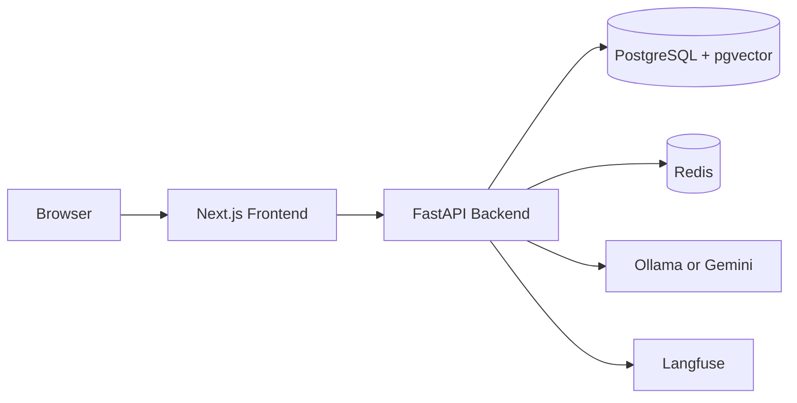

# GasBot Vietnam

GasBot Vietnam — Simple gas LPG sales website with Vietnamese AI chatbot.

[](#)
[](#)
[](LICENSE)

## Live Demo

- Frontend: TODO
- Backend API: TODO
- API Docs: TODO

## Tech Stack

| Layer | Technology |
| --- | --- |
| Frontend | Next.js 14, TypeScript, Tailwind CSS, shadcn/ui |
| Backend | FastAPI, Python 3.11, Pydantic v2 |
| Database | PostgreSQL 16, Supabase, pgvector |
| Cache | Redis 7 |
| LLM | Ollama local, Gemini Flash production |
| Observability | Langfuse, Sentry |
| Deployment | Vercel, Railway, Supabase |

## Quick Start

```bash
cp .env.example .env
make docker-up
make dev
```

## Architecture

See [docs/architecture.md](docs/architecture.md).



## Project Structure

```text
frontend/       Next.js 14 application
backend/        FastAPI application
docs/           Architecture, API, deployment, security docs
scripts/        Local development scripts
cloudflare/     Optional Cloudflare Tunnel demo mode
.github/        CI and deployment workflows
```

## Development

See [docs/development.md](docs/development.md).

## Deployment

See [docs/deployment.md](docs/deployment.md).

Deployment targets:

- Frontend on Vercel.
- Backend on Railway.
- PostgreSQL database on Supabase.
- Gemini Flash for production LLM calls.

## Contributing

1. Create a feature branch.
2. Keep code, comments, and docs in English.
3. Keep user-facing UI text in Vietnamese.
4. Run tests and linters before opening a pull request.

## License

MIT. See [LICENSE](LICENSE).
